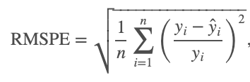

# Rossmann Sales Prediction
This repository describes the Mini Competition run in Data Science Retreat - Batch 25 between 2-4 February 2021, by the Team 3 composed by:
* Gert-Jan Dobbelaere
* Sergio Vechi
* Alberto Julián

## Introduction
This DSR mini-competition is based on a Kaggle competition which run from Sep 30, 2015 to Dec 15, 2015:

https://www.kaggle.com/c/rossmann-store-sales/overview/

### Generic objectives of the competition
* Develop an end-to-end Data Science project
* Live the experience of working as a Data Science team, sharing python code and jupyter notebooks through Github
* Present results to an audience

### Specific objectives of the competition
The Rossmann competition aims to predict sales on more than a thousand stores based on historic sales and additional information provided.

### Scoring Criteria

The competition is scored based on a composite of predictive accuracy, following a metric detailed below, and reproducibility.

### Information provided
Two csv files were provided for training the models:
* train.csv
* store.csv

Both datasets are described in the EDA jupyter notebook.

Additionally, a test dataset was provided to check the accuracy of the models. The holdout test period is from 2014-08-01 to 2015-07-31. The holdout test dataset has the same format as `train.csv`, and is called `holdout.csv`.


## Content of the repository

Apart from the aforementioned datasets, the following files have been created:

### Python files
* data_cleaning_rossman.py: performs the data cleaning of the datasets
* feature_eng.py: performs the feature engineering of the cleaned datasets
* models.py: includes the models tested and the accuracy based on the metric (TODO)
* utils.py: plots sales of a bunch of stores in several modes: grouped by 
month, day of the week, week of the year

### Jupyter notebooks
* EDA_rossman.ipynb: Exploratory Data Analysis of the datasets
* sales_plot.ipynb: shows several sets of sales plots in several modes
* pipeline.ipynb: shows a complete tour through the stages deployed in the python files: data cleaning, feature engineering and modelling

## Installation instructions
```bash
git clone https://github.com/albertojulian/rossman-sales-pred
pip install -r requirements.txt
```
# TODO FINISH INSTALL INSTRUCTIONS

## Predictive accuracy

The task is to predict the `Sales` of a given store on a given day.

Submissions are evaluated on the root mean square percentage error (RMSPE):



```python
def metric(preds, actuals):
    preds = preds.reshape(-1)
    actuals = actuals.reshape(-1)
    assert preds.shape == actuals.shape
    return 100 * np.linalg.norm((actuals - preds) / actuals) / np.sqrt(preds.shape[0])
```

